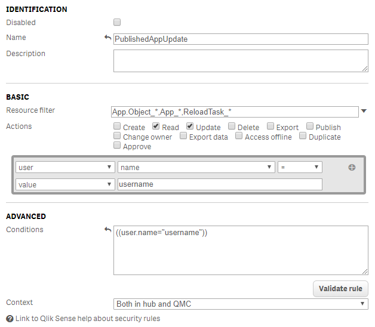
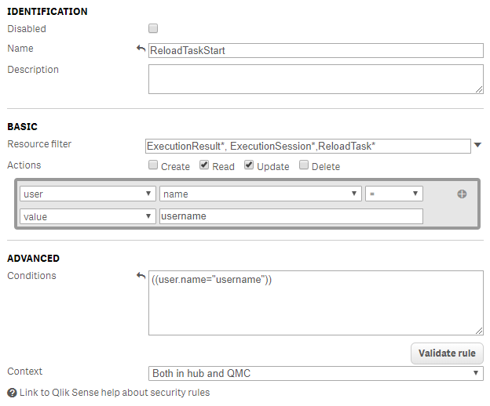

# AppTaskReload

Simple Qlik Sense Extension for reloading current app or selected server task

## Installation

1. Download archive AppTaskReload.zip from dist/ folder
2. Visit your servers' QMC
3. Navigate to extensions section
4. Click import button and choose archive AppTaskReload.zip

## Extension configuration

1. Drop extension onto your Qlik Sense sheet
2. Configure the extension to reload current app or to start task selected from task list. If you select this option you can configure behaviour of the extension either to just start the task or additionally to wait for current app to be reloaded
3. If the extension is set to reload current app it is possible to select partial reload option
4. Under appearance section you can set custom button label

## Usage

1. Click button to start app reloading or to trigger selected task depending on configuration
2. After successful reload button will become green
3. If reload error will occur button will become red

## Qlik Sense configuration

### Qlik Sense Desktop

No configuration is required

### Qlik Sense Enterprise

Only users with professional licenses or token based licenses are allowed to modify apps and only that users will be able to use this extension

#### Current app reload option

1. If the app is not yet published and you are the app owner no configuration is required
2. If app is published add below security rule in QMC (example enabling single user to perform published app update and reloading)

#### Selected task reload option

1. Add above security rule
2. Add below security rule (example enabling single user to perform task reloading)

## Additional information

If access denied message is displayed security rules for current user are not set properly or user has analyzer license assigned

## License

[MIT](https://choosealicense.com/licenses/mit/)