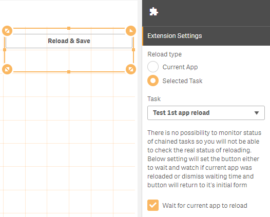

# AppTaskReload

Simple Qlik Sense Extension for reloading current app or selected server task.

## Installation

1. Visit your servers' QMC
2. Navigate to extensions section
3. Upload archive AppReloadSave.zip 

## Usage

1. Drop extension onto your Qlik Sense sheet
2. Configure the extension to reload current app or to start task selected from task list. If you select this option you can configure the behaviour of extension either to just start the task or additionally to wait for current app to be reloaded
3. After successful reload the button will become green

## Additional info

Users must have proper security rules applied in QMC in order for this extension to work

## License

[MIT](https://choosealicense.com/licenses/mit/)